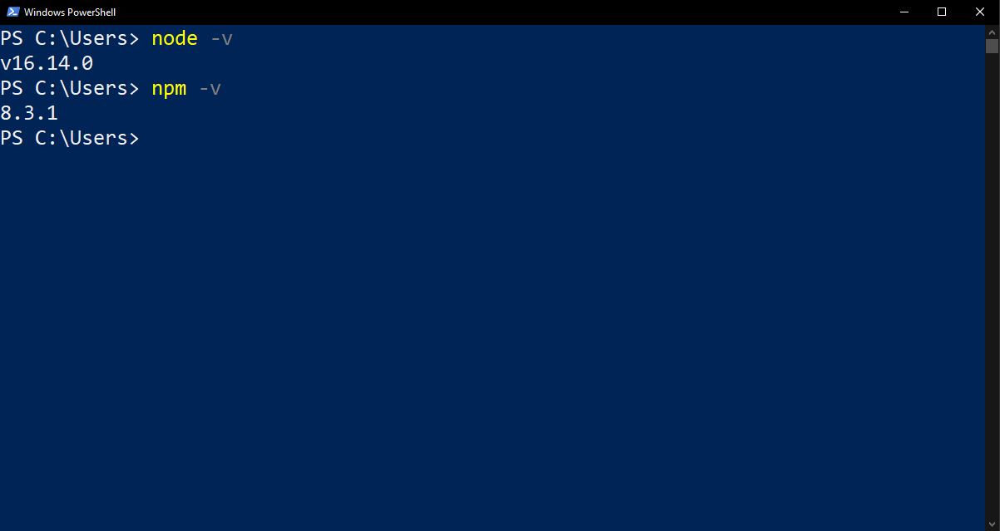
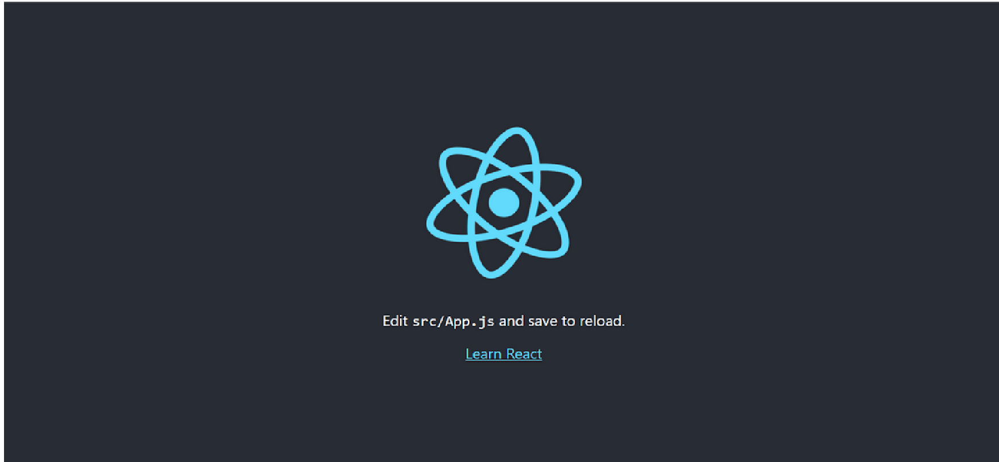
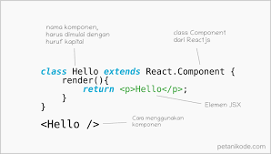
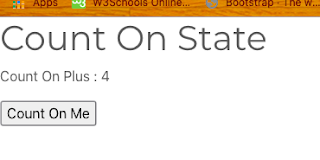

# REACT JS

- **React JS** adalah sebuah pustaka/library javascript yang bersifat open source untuk membangun User Interface yang dibuat oleh Facebook. React JS hanya mengurusi semua hal yang berkaitan dengan tampilan dan logika di sekitarnya.

- Kenapa Menggunakan React Js?
1. React js sangat cepat dalam hal membuat aplikasi frond-end walaupun harus menghandel berbagai data.
2. React Js membagi satu tampilan website menjadi komponen-komponen kecil.
3. React js sangat popular karena di seluruh dunia kebanyakan perusahaan teknologi menggunakan React sebagai develop website ataupun aplikasi

## Instalisasi React Js
Ada beberapa tahapan dalam menginstalisasi React Js 

1. Menginstal Terlebih dahulu Node.js
-  Pastikan Anda telah menginstal Node dan NPM dengan menjalankan perintah sederhana untuk melihat versi masing-masing yang diinstal:

- Untuk melihat apakah Node terinstal, buka Command Prompt Windows, Powershell  perintah ketik node --version.
- Untuk melihat apakah NPM terinstal, ketik npm --version di Terminal.

2. Inisialisasi Proyek
- Buka Terminal atau Command Prompt (CMD)
- Lakukan perintah pada terminal yang telah dibuka :
npx create-react-app [name-project]
- Contoh :
npx create-react-app example-project-1

3. Menjalankan Proyek
- Buka folder proyek yang telah dibuat, kemudian jalankan Terminal / CMD pada folder tersebut.
- Lakukan perintah npm run start
Jika sudah dijalankan tampilan yang muncul seperti gambar dibawah :
 
- setelah semua selesai kita siap untuk membuat proyek

- File extension dari react js adalah JSX

Rules JSX
1. Hanya boleh memiliki 1 parent
2. Memiliki DOM manipulation
3. Atribut class di tag HTML harus menggunakan className
4. Menggunakan curly braces untuk mengakses variabel JSX

# REACT JS COMPONENT
- Componen : Merupakan salah satu core dalam react js yang dimana component membagi UI dalam satuan kecil artinya dalam 1 page ada beberapa component yang bisa dibuat.

- Ada 2 cara membuat component :
1. Menggunakan Function
2. Menggunkaan Class

contoh menggunakan function

Contoh menggunakan Class

# PROPS DAN STATE

- Props : suatu cara untuk mengirim dan mengakses data dari komponent lain secara langsung.

- State : sebuah object untuk menyimpan data pada React dan akan di render atau muat ulang ketika data mengalami perubahan.

Contoh penggunaan state pada class component React.js di App.js

    import React, { Component } from 'react'

    export default class App extends Component {
    constructor(props) {
    super(props)
    this.state = {
      count: 0,
        }
    }

    // For Add Count
    onCount = () => {
    this.setState({ count: this.state.count + 1 })
    }

    render() {
        return (
      

        <h1>Count On State</h1>
        
Count On Plus : {this.state.count}

        <button onClick={this.onCount}>Count On Me</button>
      

            )
        }
    }

Menghasilkan seperti

Contoh penggunaan props pada class component React.js di App.js

    import React, { Component } from 'react'
 
    export default class App extends Component {
    render() {
    return <User name="Jone Doe" />
        }
    }
 
    // Other Component
    class User extends Component {
    render() {
    return (
      

        <h1>Welcome user: {this.props.name}</h1>
      

            )
        }
    }

Menghasilkan seperti

# Styling component
ada beberap cara untuk styling di react js

1. melakukan import komponen cssnya ke yang membutuhkan dengan printah

    import "./nama-file.css";

2. bisa juga seperti

    const Header ({text, size}) =>{
     const styleHeader = {
     fonsSize = size
     color = blue
    };

3. Mengguakan boostrap

ada beberapa cara untuk menggunakan bootstrap yaitu:

- memanggil link bootstrap di publick di dalam index.html dengan cara copy link boostrap tersebut

- melakukan download folder vendor dengan cara

1. Membuat folder baru di public
2. lakukan download di bootsrap " https://boostrap.com"
3. Download dan pilih compile CSS dan JS lalu klik download
maka secara otomatis file yang di download akan secara langsung tersimpan pada folder yang dibuat

# REACT LIFECYCLE
- Lifecycle pada React adalah aktifitas method yang dilakukan oleh React ketika aplikasi di jalankan.

Ada beberapa method pada react lifecycle 
1. ComponentDidMount dan ComponentWillMount
2. ComponentDidUpdate

Contoh penggunaan ComponentDidMount dan ComponentWillMount

    import React, { Component } from 'react'
    class App extends Component {
    constructor(props) {
    super(props)
    this.state = { date: new Date() }
    }

    componentDidMount() {
    this.timerID = setInterval(() => this.tick(), 1000)
    }

    componentWillUnmount() {
    clearInterval(this.timerID)
    }

    tick() {
    this.setState({
        date: new Date(),
        })
    }

        render() {
        return (
        

        <h1>Hello, dunia!</h1>
        <h2>Ini {this.state.date.toLocaleTimeString()}
        </h2>
        

            )
        }
    }

    export default App

Contoh penggunaan ComponentDidUpdate

    import React, { Component } from 'react'
    class App extends Component {
    constructor(props) {
    super(props)
    this.state = { size: 100 }
    this.boxRef = React.createRef()
    }

    handleIncrementClick = () => {
    // set new state to force update
    this.setState((state, props) => ({ size: state.size + 200 }))
    }

    componentDidUpdate(prevState, prevProps) {
    // react to update and change the HTML element's size
    this.boxRef.current.style.width = `${this.state.size}px`
    this.boxRef.current.style.height = `${this.state.size}px`
    }

    render() {
    return (
      

        <button onClick={this.handleIncrementClick}>Resize</button>
        

        

            )
        }
    }

    export default App
